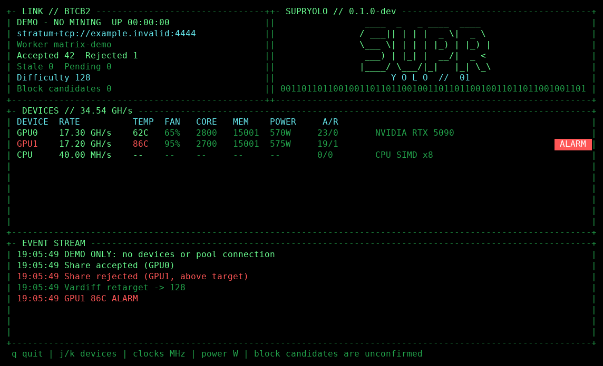

# supryolo

A modular, source-available BTCB2 BLAKE2b miner by **ocminer**.

**Version 0.2.1.** NVIDIA CUDA, AMD OpenCL, runtime-dispatched AVX2 CPU mining,
BTCB2 Stratum V1, encrypted Stratum V2 and pool-hosted DATUM gateways, GPU monitoring/control and a Matrix-style terminal dashboard
are implemented. GPU and CPU shares have been accepted by B2Pool and checked
independently. See [binary downloads, HiveOS, mmpOS, Docker and Windows setup](docs/RELEASES.md)
for packages, requirements and platform validation limits.

The same binary runs on NVIDIA and AMD rigs. OpenCL hashing and live shares
have been validated on RX 7600 XT, RX 7900 XTX and Vega 20 hardware.
Direct-node RPC solo mining and FPGA backends are planned.
Pool solo mining uses the same Stratum client, with the pool’s solo port.



[Build](#build) · [Quick start](#quick-start) · [Performance](#performance) ·
[DATUM](#datum-gateway-mining) · [Command examples](#command-examples) · [Common mistakes](#common-mistakes)

## Downloads

Get [release packages](https://github.com/ocminer/supryolo/releases/latest).
For Linux, extract the archive, edit the `WALLET` line in `start.sh`, then run
`./start.sh`. It starts B2Pool GPU mining with all cards and CPU disabled.
The script refuses to run until you replace the address placeholder.

See [installation instructions](docs/RELEASES.md) for HiveOS flight sheets,
mmpOS profiles, Docker commands and the Windows package. Linux binaries need
glibc 2.35+; Windows currently uses OpenCL, not CUDA.

## Stratum V2 (encrypted mining)

BTCB2 Standard Channels use mandatory pool authentication. Version 0.2.1
also updates block-candidate tracking for SV2.
Use **`stratum2+tcp://`**, including the `2`, and the pool's authority key.
The key below belongs to B2Pool; for another pool, obtain its own key.

| Devices | Shared SV2 port | Solo SV2 port | Minimum difficulty |
|---|---:|---:|---:|
| ASIC | 13333 | 13334 | 1024 |
| GPU / FPGA | 14444 | 14445 | 128 |
| CPU | 15555 | 15556 | 1 |

**Solo status (2026-09-07):** GPU and CPU solo share acceptance was verified
on **DE, HEL and ORD** using the published v0.2.0 binary after the pool update.
The checks recorded 28 accepted shares and no rejects; one additional ORD GPU
share remained unconfirmed when the test stopped. No network block was found.

The ports run on **`de.b2pool.io`**, **`hel.b2pool.io`** and **`ord.b2pool.io`**,
with the same authority key. Select the region nearest your rig. For pool solo
mining, use the solo port: GPU example `stratum2+tcp://de.b2pool.io:14445`, CPU
example `stratum2+tcp://de.b2pool.io:15556`. Accepted solo shares are work reports,
not block rewards; solo rewards require finding a block.

Extended Channels and Job Declaration are not supported by this miner release.
Job Declaration with a local Knots node is deferred; see the [roadmap](docs/TODO.md).
SV1 remains available.
A password is not sent by the SV2 Standard Channel protocol; use your payout
address and worker name as the identity.

**All GPUs, no CPU:** replace `YOUR_BTCB2_ADDRESS` with your address.

```sh
./supryolo --url stratum2+tcp://de.b2pool.io:14444 \
  --sv2-authority cc22ab3495b26c1a5d0a5c834df4ae8926cc7dbf8ef6c292f951f174280cd323 \
  --user YOUR_BTCB2_ADDRESS.rig1 --no-cpu
```

**Only GPU 0 and GPU 2:** add `--gpu-device 0,2` to that command. Every omitted
GPU stays unused. GPU clocks, power limits, temperature alarms, TUI and API use
the same options as SV1; for example add `--powerlimit 250 --gpu-temp-alarm 85`.
Only set power/clock values supported by your hardware.

**CPU only, eight threads:**

```sh
./supryolo --url stratum2+tcp://de.b2pool.io:15555 \
  --sv2-authority cc22ab3495b26c1a5d0a5c834df4ae8926cc7dbf8ef6c292f951f174280cd323 \
  --user YOUR_BTCB2_ADDRESS.cpu1 --no-gpu --cpu-threads 8
```

**Simplest Linux start:** edit `WALLET` in `start.sh`, then run:

```sh
PROTOCOL=sv2 ./start.sh --gpu-device 0,2
PROTOCOL=sv2 MODE=cpu ./start.sh --cpu-threads 8
```

**HiveOS:** put `stratum2+tcp://de.b2pool.io:14444` in Pool URL and
`--sv2-authority cc22ab3495b26c1a5d0a5c834df4ae8926cc7dbf8ef6c292f951f174280cd323` in Extra config arguments.
The existing Wallet and worker template stays the same. **mmpOS:** use the full
SV2 URL as the pool and pass the same authority option in extra arguments.

**Docker:** use the same arguments after `ocminersupr/supryolo:0.2.1` in the
Docker examples below. **Windows:** replace `./supryolo` with `supryolo.exe` and
put each command on one line (the shell continuation `\` is for Linux).

An authentication error is a reason to check the key and endpoint; the miner
never silently downgrades to an unencrypted connection.

## DATUM gateway mining

Connect to B2Pool's hosted DATUM gateway using **`stratum+tcp://`**. The gateway
provides work and handles its node connection; you do **not** need to install
Knots or a gateway on your mining rig. The miner-facing connection is Stratum
V1, so use the usual wallet, worker and device options. Do not use the SV2 URL
scheme or authority option for these ports.

| Devices | B2Pool DATUM endpoint | Approximate minimum difficulty |
|---|---|---:|
| GPU | `stratum+tcp://de.b2pool.io:24444` | 128 |
| CPU | `stratum+tcp://de.b2pool.io:25555` | 1 |
| ASIC tier | `stratum+tcp://de.b2pool.io:23333` | 16384 |

These endpoints provide **shared mining on DE only**. There is no DATUM solo
endpoint; use the SV1 or SV2 solo ports for pool-solo mining. Small differences
in the displayed difficulty, such as 127.998 instead of 128, are expected.

**GPU 0 only (all other GPUs and the CPU stay unused):**

```sh
./supryolo --url stratum+tcp://de.b2pool.io:24444 \
  --user YOUR_BTCB2_ADDRESS.rig1 --no-cpu --gpu-device 0 --tui
```

**CPU only:**

```sh
./supryolo --url stratum+tcp://de.b2pool.io:25555 \
  --user YOUR_BTCB2_ADDRESS.cpu1 --no-gpu --cpu-threads 8 --tui
```

**Using `start.sh`:** edit its wallet address first.

```sh
PROTOCOL=datum ./start.sh --gpu-device 0,2
PROTOCOL=datum MODE=cpu ./start.sh --cpu-threads 8
```

To use GPU power limits or temperature alarms, append the same options as for
other pools, for example `--powerlimit 250 --gpu-temp-alarm 85`. Choose settings
appropriate for your hardware; temperature alarms do not automatically throttle
or stop mining. See [device and clock examples](#command-examples).

**HiveOS:** use the GPU endpoint above as Pool URL, your wallet/worker template,
and `--gpu-device 0,2` in Extra config arguments if needed. **mmpOS:** select the
same pool URL and put device options in extra arguments. **Windows:** replace
`./supryolo` with `supryolo.exe` and put the command on one line.

A warning that extranonce subscription is unavailable is harmless on this
gateway. Accepted shares are work acknowledgements, not confirmed block rewards.

## Build

Requirements: Linux, CMake 3.24+, a C++20 compiler, Rust/Cargo, OpenSSL development files,
a CUDA toolkit for NVIDIA builds, and OpenCL headers for OpenCL builds. Python 3 runs integration tests.
OpenCL headers (`CL/cl.h` and `CL/cl_ext.h`) are needed when `YOLO_OPENCL=ON`
(the default). OpenCL is loaded dynamically; its kernels are embedded in the
executable. The JSON dependency is included with its license. NVIDIA telemetry uses
the driver's NVML library at runtime; no separate NVML development package is needed.

```sh
cmake -S . -B build -DCMAKE_BUILD_TYPE=Release -DCMAKE_CUDA_ARCHITECTURES=120
cmake --build build -j
ctest --test-dir build --output-on-failure
./build/yolo_tests 0
python3 tests/stratum_mock.py ./build/supryolo
```

SV2 is enabled by default and uses a locked Rust dependency. The release builder
pins Rust 1.97.1. Use `-DYOLO_SV2=OFF` only if you need an SV1-only build without Rust.

CPU-only build, without a CUDA toolkit:

```sh
cmake -S . -B build-cpu -DCMAKE_BUILD_TYPE=Release -DYOLO_CUDA=OFF -DYOLO_OPENCL=OFF
cmake --build build-cpu -j
ctest --test-dir build-cpu --output-on-failure
```

An OpenCL/CPU build without the CUDA toolkit uses the same executable name:

```sh
cmake -S . -B build-opencl -DCMAKE_BUILD_TYPE=Release -DYOLO_CUDA=OFF
cmake --build build-opencl -j
```

The combined build can contain CUDA, OpenCL and CPU support together. Automatic
selection uses CUDA for NVIDIA and OpenCL for AMD. `--gpu-backend cuda` or
`--gpu-backend opencl` restricts discovery to one API; the latter can also be
used for OpenCL diagnostics on NVIDIA. Use `--list-devices` with the same
backend option to see the corresponding device indices.

## Quick start

All commands below assume the combined binary is `./build/supryolo` and are
run from the source directory. If you built another configuration, substitute
`./build-opencl/supryolo` or `./build-cpu/supryolo`. If the executable is in your
current directory, use `./supryolo` instead.

**First identify your GPUs; do not guess their numbers:**

```sh
./build/supryolo --list-devices
```

Device numbers start at **0**. Use the number printed after `GPU`.
Replace `YOUR_BTCB2_ADDRESS` below with your BTCB2 payout address. Keep `.rig1`
or replace it with your own worker name, for example `.garage`.

**Start GPU 0 only, with CPU mining disabled:**

```sh
./build/supryolo --url stratum+tcp://de.b2pool.io:4444 \
  --user YOUR_BTCB2_ADDRESS.rig1 --gpu-device 0 --no-cpu
```

Copy the entire command. A backslash `\` continues the command on the next
line; do not put spaces after it. Press `q` in the TUI or `Ctrl+C` to stop.

**Defaults matter:** without `--gpu-device`, all discovered GPUs are used.
Without `--no-cpu`, CPU mining is enabled too. No clock, power or fan setting
is changed unless its control flag is supplied. Previously applied settings
remain active until explicitly reset.

| B2Pool mode | Port | Example endpoint |
|---|---:|---|
| GPU shared mining | 4444 | `stratum+tcp://de.b2pool.io:4444` |
| CPU shared mining | 5555 | `stratum+tcp://de.b2pool.io:5555` |
| GPU pool-solo | 4445 | `stratum+tcp://de.b2pool.io:4445` |
| CPU pool-solo | 5556 | `stratum+tcp://de.b2pool.io:5556` |

Pool-solo still connects to a pool. Direct-node RPC solo is not implemented.
`--password x` is the default. The listed B2Pool ports use plain TCP; do not
change them to TLS URLs. Other endpoints can use `stratum+tls://` or
`stratum+ssl://` when they support TLS; certificate verification is enabled.

User agent: `supryolo/0.2.1`.

## Performance

RTX 5090 and RX 7900 XTX entries were refreshed with v0.2.1 live DATUM gateway runs
(150 and 180 seconds respectively). Other entries retain the earlier SV1
measurements; the hashing kernels are unchanged.

Measured on the supported hardware; these are scanned hashes per elapsed
second, not estimates from the arrival times of a few shares.

| Device | Configuration | Measured rate | Measurement |
|---|---|---|---|
| RTX 5090 32 GB | Release CUDA settings | 17.15 GH/s | Live B2Pool DATUM gateway, 150 seconds |
| RX 7900 XTX 24 GB | Default OpenCL settings | 5.784 GH/s | Live B2Pool DATUM gateway, 180 seconds |
| RX 7600 XT 16 GB | OpenCL, variant 3, group 64 | 2.09 GH/s | Local benchmark, 4 seconds |
| Instinct MI50/MI60, Vega 20 16 GB | OpenCL, variant 3, group 64 | 2.75 GH/s | Local benchmark, 4 seconds |
| Ryzen 9 3950X | AVX2, 15 threads | 366.7 MH/s | Local benchmark, 10 seconds |
| Ryzen 9 3950X | AVX2, 1 thread | 27.1 MH/s | Local benchmark, 5 seconds |
| Ryzen 9 3950X | Scalar, 1 thread | 4.0 MH/s | Local benchmark, 5 seconds |

The RX 7600 XT and Vega 20 local results are short tuning samples, not sustained
guarantees. One Vega 20 card reached 85°C and about 1.9 GH/s in the multi-card
run, which was stopped early; cooling needs attention for sustained operation. AMD driver versions
3581.0 (Navi 31) and 3649.0 (Navi 33/Vega 20) were used.
CPU thread scaling depends on other workloads and cooling. The RTX 5090 live rate
was measured on one card; it is not an isolated dual-GPU result. CUDA 13.3,
architecture 120 was used for the initial measurements. The v0.2.1 release
uses CUDA 12.8.1. See [validation and live acceptance](docs/VALIDATION.md).

```sh
./build/supryolo --benchmark --no-cpu --gpu-device 0 --seconds 30
./build/supryolo --benchmark --no-gpu --cpu-threads 15 --seconds 30
```

Default CUDA tuning is `--variant 3 --block 256 --batch 67108864`.
Automatic OpenCL tuning uses variant 3 on AMD drivers exposing
`cl_amd_media_ops`, otherwise the native variant 0, with 64 threads per
workgroup. `--block 0` selects these per-backend defaults.
Use `--variant` for CUDA or `--opencl-variant` for OpenCL; see `--help`.
Larger batches can increase job-switch latency. Every GPU/AVX2 candidate is
independently rehashed and checked against the full 256-bit target before
submission. GPU candidate-buffer overflow is an explicit error.

## Command examples

### Choose exactly which devices mine

**All GPUs, no CPU:**

```sh
./build/supryolo --url stratum+tcp://de.b2pool.io:4444 \
  --user YOUR_BTCB2_ADDRESS.all-gpus --no-cpu
```

**GPU 1 only:** GPU 0 and every other GPU are excluded.

```sh
./build/supryolo --url stratum+tcp://de.b2pool.io:4444 \
  --user YOUR_BTCB2_ADDRESS.second-card --gpu-device 1 --no-cpu
```

**GPUs 0 and 2 only:** leave GPU 1 free, for example for the desktop or another
application. This example requires a listed GPU 2. Any other GPU is excluded.

```sh
./build/supryolo --url stratum+tcp://de.b2pool.io:4444 \
  --user YOUR_BTCB2_ADDRESS.selected --gpu-device 0,2 --no-cpu
```

Use a comma-separated list **without spaces**. `-d 0,2` is an alias for
`--gpu-device 0,2`. There is no separate exclusion flag: list the GPUs you
want to use. The miner does not stop an application already using a card.

**GPU 0 plus four CPU threads:**

```sh
./build/supryolo --url stratum+tcp://de.b2pool.io:4444 \
  --user YOUR_BTCB2_ADDRESS.mixed --gpu-device 0 --cpu-threads 4
```

**CPU only, four threads:** all GPUs are disabled. Use the CPU pool port.

```sh
./build/supryolo --url stratum+tcp://de.b2pool.io:5555 \
  --user YOUR_BTCB2_ADDRESS.cpu --no-gpu --cpu-threads 4
```

`--cpu-threads 0` means automatic thread selection, not CPU off. Omit
`--cpu-threads` for the same automatic behavior. AVX2 is selected automatically
when available; `--cpu-variant scalar` forces the portable reference kernel.
Do not combine `--no-gpu` with `--gpu-device`. Giving both `--no-cpu` and
`--no-gpu` exits with a no-devices error.

### NVIDIA, AMD and mixed rigs

The default `--gpu-backend auto` uses CUDA for NVIDIA and OpenCL for AMD,
including both vendors if present. Device numbers are assigned to that list.

To use **only CUDA/NVIDIA**, inspect and mine with the same backend option:

```sh
./build/supryolo --gpu-backend cuda --list-devices
./build/supryolo --gpu-backend cuda --gpu-device 0 --no-cpu \
  --url stratum+tcp://de.b2pool.io:4444 --user YOUR_BTCB2_ADDRESS.nvidia
```

On an **AMD-only rig**, the ordinary quick-start command already selects
OpenCL automatically. You can also select it explicitly:

```sh
./build/supryolo --gpu-backend opencl --list-devices
./build/supryolo --gpu-backend opencl --gpu-device 0 --no-cpu \
  --url stratum+tcp://de.b2pool.io:4444 --user YOUR_BTCB2_ADDRESS.amd
```

**Changing the backend can change GPU numbers.** Always use the same backend
option for `--list-devices` and mining. Explicit `opencl` is an API selection,
not an AMD-only filter: it can expose NVIDIA OpenCL devices too. On a mixed
rig, use `auto`, inspect the names and select the desired numbers.
`CUDA_VISIBLE_DEVICES` can also change CUDA numbering.

### Frequencies, power and fans on NVIDIA

Units are **MHz** for clocks, **watts** for power and **percent** for fans.
Clock values are absolute values, not offsets. Memory clocks use driver units,
which can differ from advertised memory data rates. Control writes may need
root, so these examples use `sudo`; ordinary mining does not require it.

**Example for an RTX 5090 listed as CUDA GPU 0:** 2400 MHz core, 10001 MHz
memory, 500 W power limit and 70% fan. These are supported syntax examples,
not a universal performance recommendation. Do not copy a 5090 power limit
onto a different model; the driver rejects values outside its supported range.

```sh
sudo ./build/supryolo --gpu-backend cuda --gpu-device 0 --no-cpu \
  --url stratum+tcp://de.b2pool.io:4444 --user YOUR_BTCB2_ADDRESS.tuned \
  --gpu-core-clock 2400 --gpu-mem-clock 10001 --powerlimit 500 \
  --gpu-fan-speed 70 --gpu-temp-warn 75 --gpu-temp-alarm 85
```

**Different settings for two RTX 5090s:** values follow the order in
`--gpu-device`, not numeric GPU order. Here that order is **1, then 0**:

```sh
sudo ./build/supryolo --gpu-backend cuda --gpu-device 1,0 --no-cpu \
  --url stratum+tcp://de.b2pool.io:4444 --user YOUR_BTCB2_ADDRESS.two-cards \
  --gpu-core-clock 2400,2500 --gpu-mem-clock 10001 \
  --powerlimit 450,500 --gpu-fan-speed 70,75
```

| Selected GPU | Core | Memory | Power limit | Fan |
|---|---:|---:|---:|---:|
| GPU 1 — first in the list | 2400 MHz | 10001 MHz | 450 W | 70% |
| GPU 0 — second in the list | 2500 MHz | 10001 MHz | 500 W | 75% |

A single value, such as `--gpu-mem-clock 10001`, applies to every selected
GPU. Otherwise, supply exactly one value per selected GPU. Unselected GPUs
are neither mined on nor configured by these flags.

### AMD clock and power examples

AMD clock values must match **existing driver-advertised DPM levels**. The
miner does not enable overdrive or accept arbitrary clock offsets. Available
levels vary by card and driver. To inspect them, replace this example PCI
address with the address shown for your AMD card by `--list-devices`:

```sh
SUPRYOLO_AMD_PCI=0000:03:00.0
cat "/sys/bus/pci/devices/${SUPRYOLO_AMD_PCI}/pp_dpm_sclk"
cat "/sys/bus/pci/devices/${SUPRYOLO_AMD_PCI}/pp_dpm_mclk"
```

The files show level numbers and MHz values. Pass the **MHz value**, not the
level number. The miner selects that DPM level; load and thermal/power limits
can still change the actual operating frequency.

**Example for an AMD-only rig whose GPU 0 is an RX 7600 XT**, when its driver
advertises 2539 MHz core and 1124 MHz memory and permits a 155 W cap:

```sh
sudo ./build/supryolo --gpu-device 0 --no-cpu \
  --url stratum+tcp://de.b2pool.io:4444 --user YOUR_BTCB2_ADDRESS.amd-tuned \
  --gpu-core-clock 2539 --gpu-mem-clock 1124 --powerlimit 155
```

Manual AMD fan writes were rejected by the tested RDNA drivers even as root.
Leave the fan setting omitted for automatic operation on those systems.
`--gpu-fan-speed 0` explicitly restores automatic fan control. A rejected
manual PWM write restores the previous fan policy and reports the error.
Power/clock settings applied earlier in the same command can remain active.
See [AMD driver details](docs/OPERATIONS.md#amd-specifics).

### Reset settings after tuning

**Omitting a control flag does not undo a previous setting.** Use `0` to reset
it. This command resets CUDA GPU 0 and runs a one-second local benchmark;
it does not connect to a pool:

```sh
sudo ./build/supryolo --gpu-backend cuda --gpu-device 0 --no-cpu \
  --benchmark --seconds 1 --gpu-core-clock 0 --gpu-mem-clock 0 \
  --powerlimit 0 --gpu-fan-speed 0
```

For AMD, use the backend and GPU number from your AMD device listing instead.
On AMD, resetting **either clock** restores **both clock domains** to automatic
mode; do not combine a zero clock reset with a nonzero clock setting.
On NVIDIA, the two clock resets are independent. Power `0` restores the card's
default limit, not a previously customized limit. Fan `0` means **automatic**,
not a stopped fan.

### Temperature alarms and display

**These are alarm thresholds, not enforced temperature limits.** They change
colors and produce events; they do not stop mining, reduce clocks or set the
fan automatically. There is currently no automatic temperature-cutoff flag.

This example warns at **70°C** and shows a red **2 Hz blinking ALARM at 80°C**:

```sh
./build/supryolo --gpu-device 0 --no-cpu --tui \
  --url stratum+tcp://de.b2pool.io:4444 --user YOUR_BTCB2_ADDRESS.monitored \
  --gpu-temp-warn 70 --gpu-temp-alarm 80
```

The default thresholds are 75°C and 85°C. The warning must be lower than the
alarm. These two settings apply to every displayed GPU; they do not accept
per-GPU comma-separated lists. Fix cooling or explicitly reduce supported
power/clock settings if a device gets too hot.

The TUI shows connection details, accepted/rejected/stale shares, per-device
rates and sensors, plus share responses and difficulty changes. `q` stops
mining; `j`/`k` scroll devices. Missing sensors display `--`.
`--tui-demo --seconds 10` previews the display without mining or configuring
hardware. The displayed block count means **block candidates**, not confirmed
network blocks.

**Five-minute run with plain logs saved to a file:**

```sh
./build/supryolo --gpu-device 0 --no-cpu --no-tui --seconds 300 \
  --url stratum+tcp://de.b2pool.io:4444 --user YOUR_BTCB2_ADDRESS.logged \
  2>&1 | tee supryolo.log
```

`--seconds` limits the run duration. Redirected output always uses plain logs.

### Benchmark and batch-size examples

Benchmarks hash locally and need no pool or payout address. Do not combine
`--benchmark` with `--url`. Specify devices and `--no-cpu` when measuring a GPU.

**NVIDIA GPU 0, explicit CUDA settings:**

```sh
./build/supryolo --benchmark --gpu-backend cuda --gpu-device 0 --no-cpu \
  --seconds 30 --variant 3 --block 256 --batch 67108864
```

**AMD GPU 0, smaller batch for comparison:**

```sh
./build/supryolo --benchmark --gpu-backend opencl --gpu-device 0 --no-cpu \
  --seconds 30 --opencl-variant 3 --block 64 --batch 16777216
```

Variant 3 requires the AMD media-operations extension; omit the variant flag
for automatic selection. CUDA uses `--variant`; OpenCL uses
`--opencl-variant`. `--batch` is hashes per GPU scan, `--block` is threads per
workgroup/block, and `--cpu-batch` controls CPU scans. A larger batch is not
necessarily faster and can delay switching to a new pool job. Change one
setting at a time and compare repeated measurements after warm-up.

## Common mistakes

| Symptom or question | What to check |
|---|---|
| The CPU is busy although I selected a GPU | Add `--no-cpu`; GPU selection does not disable CPU mining. |
| More GPUs are mining than intended | Supply `--gpu-device` with only the wanted indices; omission selects all. |
| I want to skip GPU 1 | For example, use `--gpu-device 0,2`; there is no exclusion flag. |
| A different GPU is selected after changing the backend | Run `--list-devices` with the same backend option you will mine with. |
| A comma-separated option fails | Remove spaces and supply either one value or one per selected GPU. |
| Does a zero clock/fan value disable a GPU? | No. It resets that control. Exclude the GPU from `--gpu-device` instead. |
| Controls fail with a permission error | They may need root; use `sudo` only when applying supported settings. |
| Controls fail with `Invalid argument` or unsupported-operation errors | Verify the card's supported values and driver capabilities. Root does not add missing driver support. |
| AMD rejects a frequency | Use an advertised DPM MHz value, not a level index or clock offset. |
| The temperature alarm flashes but mining continues | Alarms are visual/log warnings; no automatic thermal cutoff is implemented. |
| I removed tuning flags but the settings remain | Explicitly reset the settings with `0`, or use your rig-management tool. |
| It exits with “No mining devices enabled” | Do not disable both CPU and GPU engines. |

For the complete driver behavior, read [operations](docs/OPERATIONS.md).

See [architecture](docs/ARCHITECTURE.md) and [third-party notices](THIRD_PARTY.md).

## License

[supryolo Noncommercial and Personal Mining License 1.0](LICENSE).
Copyright (c) 2026 ocminer.

- **Private mining is allowed, including earning and selling mining rewards.**
- Noncommercial use, modification and sharing of source or binaries are allowed
  with the license and notices retained.
- **Commercial use requires prior written permission from ocminer**, including
  business mining, paid services, selling or commercially distributing the
  miner, embedding it in hardware sold to customers, and using even part of
  its code in commercial products. Bundling it for free with a paid product
  also requires permission.

Request permission through a [commercial licensing issue](https://github.com/ocminer/supryolo/issues/new?title=Commercial%20licensing%20request).
The full license defines the terms. This is a source-available license, not
MIT or an OSI-approved open-source license. Previously granted MIT rights
for earlier versions or portions remain unaffected. Dependencies retain their
own licenses; see [third-party notices](THIRD_PARTY.md).
